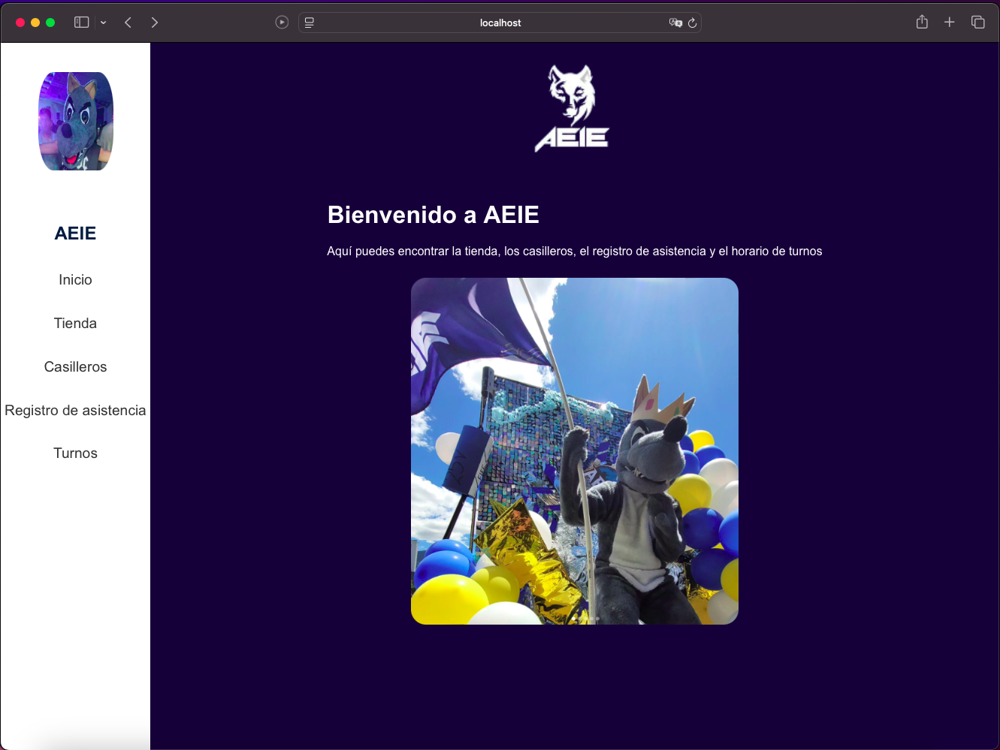

# Desarrollo de Interfaces del Proyecto de Aplicaciones Web y Móviles  
### Tecnologías de la Información - Escuela Politécnica Nacional - 2024B  

**Estudiantes:**  
- Stalin Garcia  
- Patricio Flor  

## **Descripción General del Proyecto**  
Este proyecto consiste en el desarrollo de una tienda en línea diseñada para la **Asociación de Estudiantes de Ingeniería Electrónica** (AEIE) de la Escuela Politécnica Nacional. La plataforma está pensada para facilitar la gestión de productos y fomentar la interacción de los estudiantes con los servicios ofrecidos por la asociación.  

El enfoque principal del proyecto es proporcionar una experiencia visual atractiva y funcional, alineada con los principios de diseño de interfaces modernas y con la necesidad de optimización tanto para web como para dispositivos móviles.

## **Estructura del Proyecto**  
La carpeta raíz del proyecto, **"Construccion-interfaces"**, incluye:  
- **`capturas/`**: Contiene imágenes de las interfaces desarrolladas, con nombres que corresponden a las carpetas de cada proyecto en `projects/`.  
- **`projects/`**: Carpeta donde se almacenan los proyectos individuales relacionados con las interfaces.  
- **`package.json`**: Archivo de configuración que detalla las dependencias utilizadas para este proyecto de interfaces.  

---

## **Interfaces del Proyecto**  
A continuación, se describen las principales interfaces desarrolladas:

### **1. Login**  
  
La primera pantalla del proyecto es la página de **inicio de sesión**.  
- **Descripción:** Permite a los usuarios autenticarse ingresando sus credenciales.  
- **Características:** Diseño intuitivo y adaptado para facilitar el acceso rápido y seguro a la plataforma.  

---

### **2. Página de Inicio**  
  
- **Descripción:** Es la vista principal a la que acceden los usuarios después de iniciar sesión.  
- **Características:** Proporciona un resumen general de las funcionalidades y accesos rápidos a las diferentes secciones del sistema.  

---

### **3. Sección Tienda**  
  
- **Descripción:** Esta interfaz permite gestionar los productos de la tienda.  
- **Características:**  
  - Vista de los productos disponibles.  
  - Filtros avanzados para buscar productos según categorías o características específicas.  
  - Opciones para editar los productos.  

#### **Modal de Edición de Productos**  
  
- **Descripción:** Modal emergente que se activa al seleccionar un producto para editar.  
- **Características:**  
  - Muestra los detalles del producto seleccionado.  
  - Permite actualizar información como nombre, precio, descripción, y otros parámetros relevantes.  

---

### **4. Crear Producto**  
  
- **Descripción:** Formulario dedicado a agregar nuevos productos al inventario.  
- **Características:**  
  - Campos específicos para introducir toda la información necesaria, como nombre, precio, descripción, imagen, y categoría.  
  - Diseño claro para garantizar una experiencia de usuario fluida y eficiente.  

---

### **5. Registro de Asistencia**  
  
- **Descripción:** Formulario para registrar la asistencia de los usuarios en actividades o eventos organizados por la asociación.  
- **Características:**  
  - Campos personalizables según el evento o actividad.  
  - Validación automática de datos para garantizar registros precisos.  

---

### **6. Casilleros**  
  
- **Descripción:** Interfaz que permite la gestión de casilleros disponibles para los estudiantes en la asociación.  
- **Características:**  
  - Vista general de los casilleros disponibles y ocupados.  
  - Permite al usuario ver el estado de cada casillero y realizar solicitudes de asignación. 

### **6. Casilleros**  
  
- **Descripción:** Interfaz que permite consultar el horario de atención de la asociación.  
- **Características:**  
  - Tabla con el horario de atención correspondiente a cada miembro.  

#### **Modal Casillero Lleno**  
  
- **Descripción:** Modal emergente que aparece cuando un casillero está lleno.  
- **Características:**  
  - Muestra el estado de un casillero ocupado.  
  - Ofrece opciones para ver otros casilleros disponibles o contactar al administrador.  

#### **Modal Casillero Vacío**  
  
- **Descripción:** Modal que aparece cuando un casillero está disponible.  
- **Características:**  
  - Muestra información sobre el casillero vacío.  
  - Permite al usuario proceder a la asignación del casillero para su uso.

---

## **Conclusión**  
Este proyecto busca no solo facilitar la gestión de recursos para la AEIE, sino también proporcionar un entorno digital intuitivo y eficiente para estudiantes y administradores. Las interfaces están diseñadas pensando en la simplicidad y en la experiencia del usuario, combinando funcionalidad y estética.  
 
